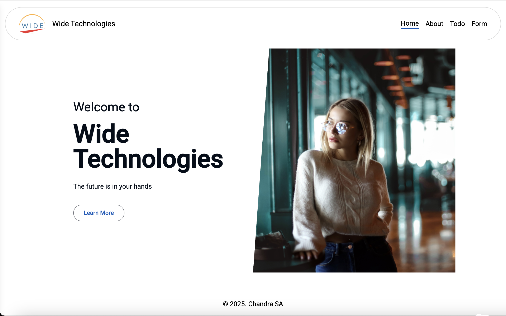

# WidetechApp

This project was generated using [Angular CLI](https://github.com/angular/angular-cli) version 19.2.4.

## Development server

To start a local development server, run:

1. run `npm run dev`, it will install the required dependencies and running server in the local on port 4200 (if available).

## Task Details

1. Task 1: Component Creation and State Management -> http://localhost:4200/form (age field)
2. Task 2: Form Handling and Validation -> http://localhost:4200/form
3. Task 3: API Integration -> http://localhost:4200/todo
4. Task 4: Routing -> http://localhost:4200/home & http://localhost:4200/about
